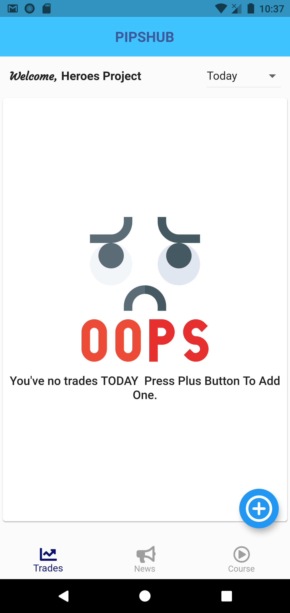

# PIPSHUB

This is a fun side project that focuses on helping forex traders achieve more consistency in their trades. It offers trade tracking system, news and courses such as ICT,BTMM,WYCKOFF e.t.c.

Your warmly welcome to create issues for features and bugs.

## Screenshots
I can't screenshot all screens due to frequent changes but the app is still in beta here is an example screen.  

## Progress

please visit https://github.com/luqmantuke/FxHub/projects/2 to see what features are on progress and ones that need to be done.
